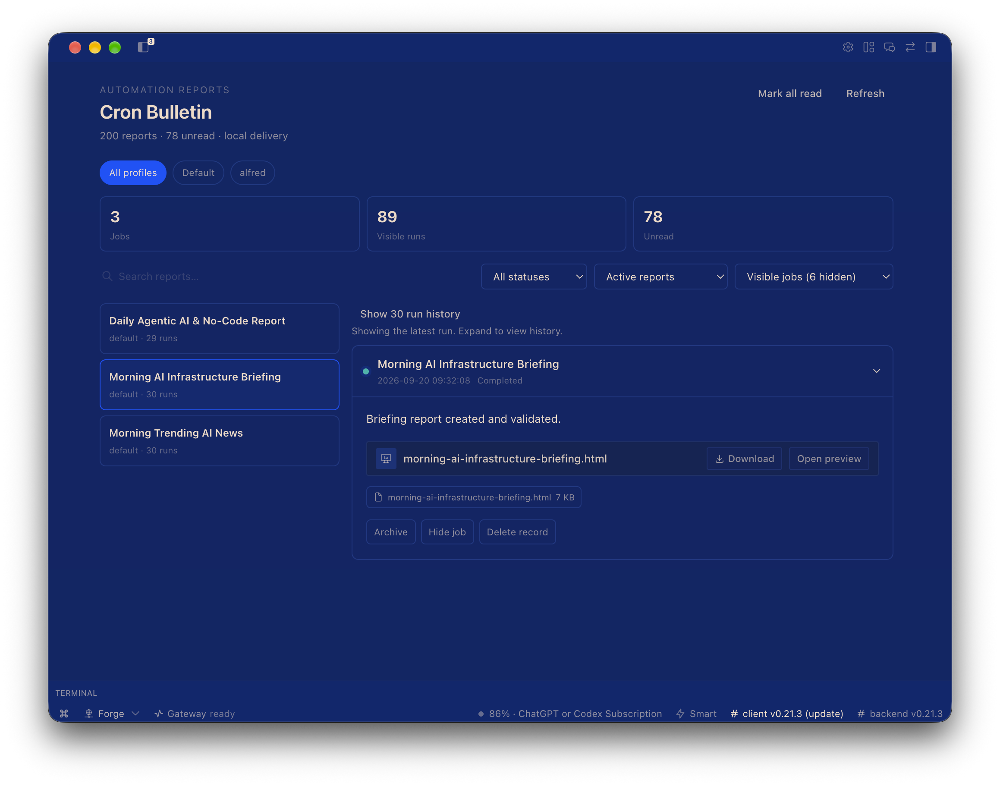

# Cron Bulletin

A unified Hermes plugin that adds a central Cron Bulletin page to Hermes Desktop without changing Hermes core.



The inbox groups reports by job and profile, defaults to **All profiles**, and keeps
the latest run visible while older runs remain available in expandable history.

## How reports arrive

Cron jobs remain ordinary Hermes cron jobs. Configure them with local delivery:

```yaml
deliver: local
```

Hermes already persists each run to `$HERMES_HOME/cron/output/<job-id>/*.md`. The plugin indexes those files, so no Telegram, Discord, Slack, or other messaging delivery is needed.

Reports may contain plain text, Markdown, and `MEDIA:/absolute/path` directives. Referenced files are accepted only when they resolve to a regular file under the active profile, the job workdir, or the OS temporary directory. Paths returned by the list API are opaque; raw server paths are not exposed.

## Desktop

Open **Cron Bulletin** from the sidebar or command palette. The page provides:

- Newest-first report feed
- Text search and status filtering
- Completed/failed indicators
- Native Markdown and media rendering
- Attachment metadata
- Persistent read/unread state
- Manual refresh plus 15-second polling

## Files

- `PLAN.md` — locked architecture and acceptance criteria
- `dashboard/plugin_api.py` — scoped report and attachment REST API
- `desktop/plugin.js` — native Desktop page
- `tests/` — Python and JavaScript behavior tests

## Verification

```bash
PYTHONPATH=~/.hermes/hermes-agent python -m pytest tests/test_plugin_api.py -q
node --test tests/plugin.test.mjs
hermes --profile teknium plugins validate ~/.hermes/profiles/teknium/plugins/cron-bulletin
```
